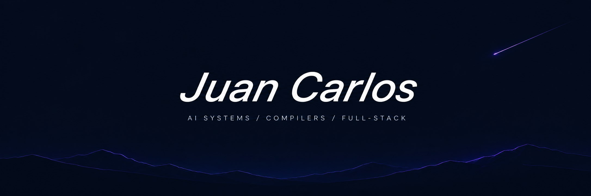
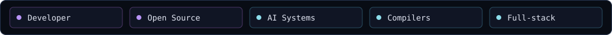

Computer Science student at **University of Havana · MatCom**. I build complete systems, from search and AI agents to compilers and full-stack applications. **Open to internships and junior software engineering opportunities.**

<a href="PROFILE.md">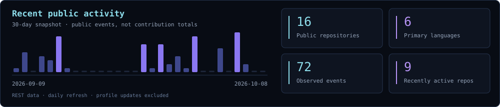</a>

<table>
<tr>
<td width="44%" valign="top">
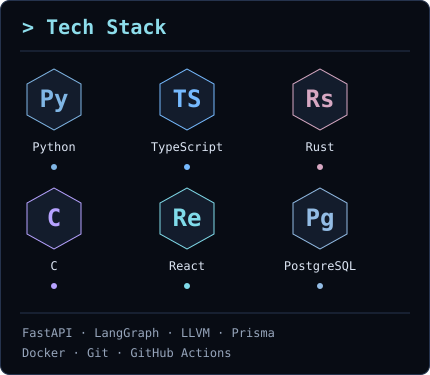
</td>
<td width="56%" valign="top">

<a href="https://github.com/jccarmenate/tech-rag-information-retrieval-system">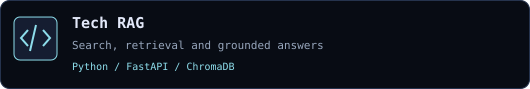</a> 
<a href="https://github.com/jccarmenate/multiagent-code-generator">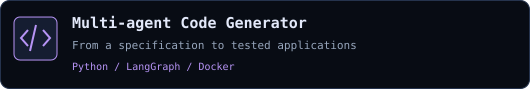</a> 
<a href="https://github.com/jccarmenate/hulk-ide">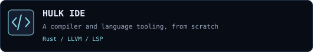</a> 
<a href="https://github.com/jccarmenate/GuildWork">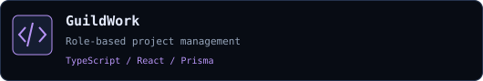</a>
</td>
</tr>
</table>

### Open-source toolbox

<a href="https://portfolio-web-eight-rose.vercel.app/">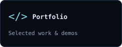</a>
<a href="https://github.com/jccarmenate?tab=repositories">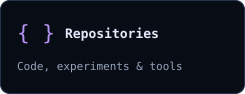</a>
<a href="LEARNING.md">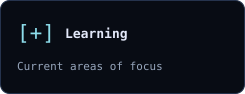</a>
<a href="mailto:juancarlosmatcom@gmail.com">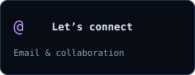</a>

Public activity refreshes daily. [About this profile](PROFILE.md) · [Email](mailto:juancarlosmatcom@gmail.com)
